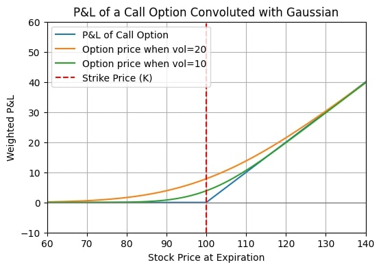
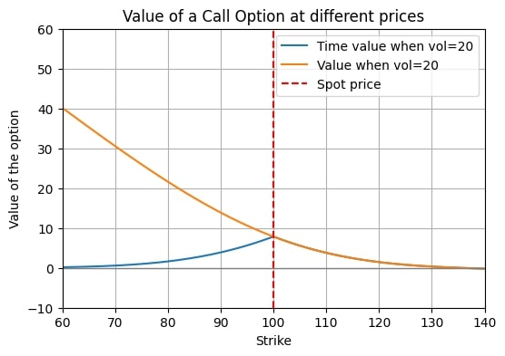
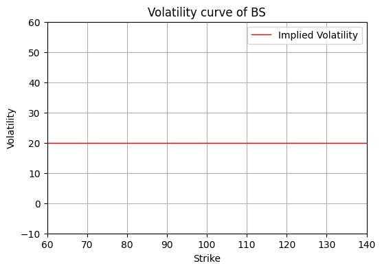
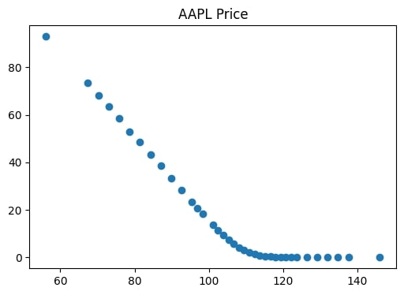
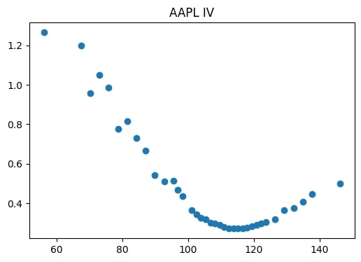

## [Home](../README.md)

# Convolution and the volatility curve

Volatility is the main factor when evaluating the price of an option. If there was no volatility, then the price of an option would just be the expected P&L at expiry. 

However, since the volatility value is almost never zero, and we still have some time to maturity, then we can expect the underlying to move around. Usually, the way we model the returns is as $N(0, t\sigma^2)$. Therefore, the value of the option is not the value at expiry, but it is an average of the values that it can reach at expiry weighted by their respective probability. 
This weighted average operation is called convolution and is defined as:

$$(f*g)(x):=\int_{-\infty}^{\infty}f(t)g(x-t)dt   $$

where f is the shifted ReLu=max(0,S-X) and g is the normal distribution of mean 0 and variance $t\sigma^2$. A friend sent me this [video](https://www.youtube.com/watch?v=KuXjwB4LzSA) which gives a cool explanation.

The value of an option is therefore the convolution of the distribution of returns and the P&L graph at expiry. [Getting the correct value of volatility](../volatility/volatility.md) is not trivial, so this is not as easy as it sounds.

The convolution is particularly tied with the normal distribution because:
* the convolution of two normal distribution is a normal distribution
* if you do the convolution of a distribution with itself many times the limit tends to a normal distribution (central limit theorem)

In this sense Gaussians (more precisly Levy distributions) are attractors for the convolution operation. This is very important because it somewhat justifies the choice of the normal as the modeling distribution of the returns. The only catch is that the CLT works only for the central part of the distribution. If the tails are very fat (power law-like), then the tail of the limiting distribution will also be fat. The central area that we can trust to be normal is $\approx N^{3/4}\sigma$ (with N being the number of times a distribution was convoluted with itself). See the first few chapters of Theory of financial risk and derivative pricing by Bouchaud for more.

The spread between the red and green line and the blue is called time value. In the money options have also (Spot-Exercise) intrinsic value. This price is the Black-Scholes price, and the value of an option with strike K is therefore:

Moreover, if we do the the inverse operation and ask ourselves, what is the volatility value of the normal that was convoluted with the pnl curve, we would get an horizontal line throughout all the strikes. This is the volatility curve of BS prices.

However, if we take the price of a call option on the market

And do the inverse operation

We don't get a straight line, this is called volatility smile. The market "overestimates" big movements ([kurtosis](../kurtosis/kurtosis.md)), and in particular big downside movements ([skew](../skew/skew.md)) (or, more likely, the market is right, and we are underestimating them!)

## How do we do the convolution?

Another cool thing about convolution is that it's possible to get it with the fourier transform:

$$ \hat{f}(y) = \int_{-\infty}^{\infty}f(x)e^{-i2\pi y \cdot x}dx $$

$$\hat{(f*g)}(x)=\hat{(f+g)}(x) = \hat{f}\hat{g}$$

So we can apply the fourier transform to the normal and get:

$$ \hat{f}_N(k) = \sqrt{\pi}e^{\frac{-k^2}{4}}$$

a gaussian! The gaussian are not only fixed points in the convolution space, but also under fourier transform (this is not a coincidence, of course).
