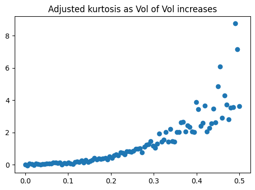

# What is the kurtosis?

The kurtosis is technically defined as the fourth normalized moment of the distribution. 

$$ \text{Kurtosis}:=E((\frac{x-\mu}{\sigma})^4)$$

or by sampling
$$ \mu_4 \approx \frac{1}{N}\sum_{i=1}^{N}\frac{(x_i-\bar{x})^4}{\sigma^4}$$

It is 3 for a normal distribution, distributions with higher values are called leptokurtic (and platikurtic the reverse). It rappresents how "fat" are the tails, and also how much "dispersed" are the returns squared. For a normalized distribution Z:
$$ \mu_4 = E(Z^4) = Var(Z^2)+ (E(Z^2))^2 =Var(Z^2) + Var^2(Z) = Var(Z^2) +1 $$

Now, there are two quetions:
* why is the the volatility curve smiling?
* how can we profit from it?

## Why is the volatility curve smiling?
There are three main reasons why OTM options are expensive:
* volatility is not constant
* volatility is correlated with spot
* returns have fat tails

If returns were all sampled from the same constant distribution, the sum would still have no kurtosis. However, volatility is always changing. The volatility of volatility makes some points concentrate around the mean, and some very far into the tails. If we sample from $\mathcal{N}(0, \sigma^2))$ where $\sigma$ is *not* fixed, but sampled from a log normal with standard deviation $\sigma^*$, as we increase $\sigma^*$ we also increase the kurtosis:

Again, this is another of the ideas behind the Henston model:

$$dX_t = X_t(mdt+\sigma_tdW)$$
$$d(\sigma_t^2)=\Omega\sigma(\sigma_t^2-\sigma_0^2)dt+\gamma\sigma_tdW' $$

Increasing $\gamma$ will increase the kurtosis.

The second reason is double: first, if both returns and volatility are random, then a big returns most likely comes from high volatility, thus the tails have the thickness of the higher volatility (and the inverse for small returns). Second, returns are skewed, and the skew will implicitly introduce some kurtosis. In fact, skew bounds kurtosis from below:
$$\text{Kurtosis} > \text{Skew}^2 +1$$

The third reason is the following: returns are not gaussians. It happens to see $20\sigma$ movements (which would never happen if they were truly gaussian). The tails in particular behave more power law like $f(x) \approx \alpha c^{-x}$. The CLT theorem would say that if we convolute this distribution enough times (granted that it has finite variance), then we would get something that resembles a gaussian. The problem is tat