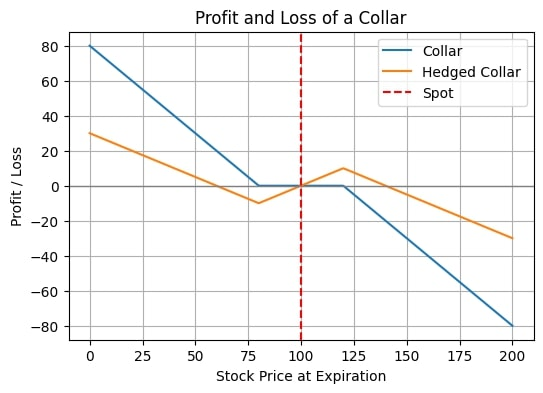

## [Home](../README.md)

# What is the skew

The skew is technically defined as the third normalized moment of the distribution. 

$$ \mu_3:=E((\frac{x-\mu}{\sigma})^3)$$

or by sampling
$$ \mu_3 \approx \frac{1}{N}\sum_{i=1}^{N}\frac{(x_i-\bar{x})^3}{\sigma^3}\approx \frac{1}{N}\sum_{i=1}^{N}\frac{\log(\frac{x_i}{x_{i-1}})}{\sigma} $$

It is zero for a normal or a symmetric distribution, and in general has the same sign as the correlation between $\log(\frac{x_i}{x_{i-1}})$ and $\log^2(\frac{x_i}{x_{i-1}})$. Now, there are two quetions:
* why is the smile skewed?
* how can we profit from it?

## Why is the smile skewed? 

There are three main reasons why the smile presents a skew
* downside protection is attractive
* volatility is correlated with spot
* the returns are not geometric

The first reason is pretty self-explanatory. Investors are long the underlying and to protect themselves against downside risk they buy out of the money put, increasing the value. 

The second reason come from the fact that (in equities at least) the returns are negatively correlated with volatility. After a big movement, we expect volatility to increase, possibly exercibating the return. This is also the idea behind the Henston model:

$$dX_t = X_t(mdt+\sigma_tdW)$$

$$d(\sigma_t^2)=\Omega\sigma(\sigma_t^2-\sigma_0^2)dt+\gamma\sigma_tdW' $$

where $dW$ and $dW'$ are correlated (and create the skew). $\Omega$ is the mean returning parameter, and create the kurtosis together with $\gamma$.

The third reason is a bit more subtle. Usually, when talking about returns, we assume them to be multiplicative factors. So, when compouding, we get the log normal distribution $e^{\mathcal{N}(\mu,\sigma^2)}$. This distribution as a skew $\approx 3\sigma$: the median needs to remain constant at $e^{\mu}$ (because the returns are symmetric), but the mean is shifted by $\frac{\sigma^2}{2}$ to the right, to account for the mode, [which is $\sigma^2$ to the left](https://www.youtube.com/watch?v=UtpLE6npxvk). This effect is also called volatily drag (Delta chapter of Dynamic Hedging by Taleb), and comes from the fact that if you gain 10% and lose 10% you are not back at 100% $(1-x)(1+x)=1-x^2$, so the most common value cannot be the median. This also tells us that the price is not a martingale, to satisfy the martingale property we need to shift by $-\frac{\sigma^2}{2}$. Now, what if the returns are not proportional to the price?
This happens often for short-scale returns. The price is now no longer correctly modelled by $e^{\mathcal{N}(\mu,\sigma^2)}$ but more like $\approx \mu+\sum_{t=1}^{N}\mathcal{N}(0,\sigma^2)$, which is not a log normal but a normal distribution. If the returns have skew 0 then the price has skew $3\sigma$, therefore if the price has skew 0 the log price has negative (shadow?) skew! See chapter 8 of Theory of financial risk and derivative pricing by Bouchaud for a better explanation.

## How can we profit from it?

Like any other thing, we can profit by buying skew when it's cheap and selling it when it's rich. To be long skew, means that we profit when the volatility becomes more tilted. A classic way to gain skew exposure is with a collar, where we bet on skew becoming more negative.

Let's consider a delta hedged collar (delta of 0, altought it could be argued that we are positive delta for small movements and negative delta for big ones). If the skew becomes more negative the price of our OTM put increases, and the OTM call decreases, making us money. Like with gamma, being long or short skew is not exactly symmetrical. Being long skew is less risky in jumpy markets (where spot is highly correlated with vol). In fact,  gamma is basically equivalent to skew:

$$\text{Vanna} = \frac{\text{dDelta}}{\text{dVol}}=\frac{\text{dVega}}{\text{dSpot}}$$

but if dVol $\approx$ dSpot then 

$$\text{Vanna} \approx \frac{\text{dDelta}}{\text{dSpot}} = \text{Gamma}$$

This is also reflected in the delta hedging process:
- if market rises $\rightarrow$ vol goes down $\rightarrow$ we make money because our short call (which is now closer) loses value $\rightarrow$ we make money, so we will need to sell high to be hedged
- if market falls $\rightarrow$ vol goes up $\rightarrow$ we make money because our long put (which is now closer) increases in value $\rightarrow$ we make money, so we will need to buy low to be hedged

Like a long gamma position is generally safe but expensive, a long skew position is also often costly (or we can say that being short skew has risk associated with it) (see Trading Volatility by Bennet).