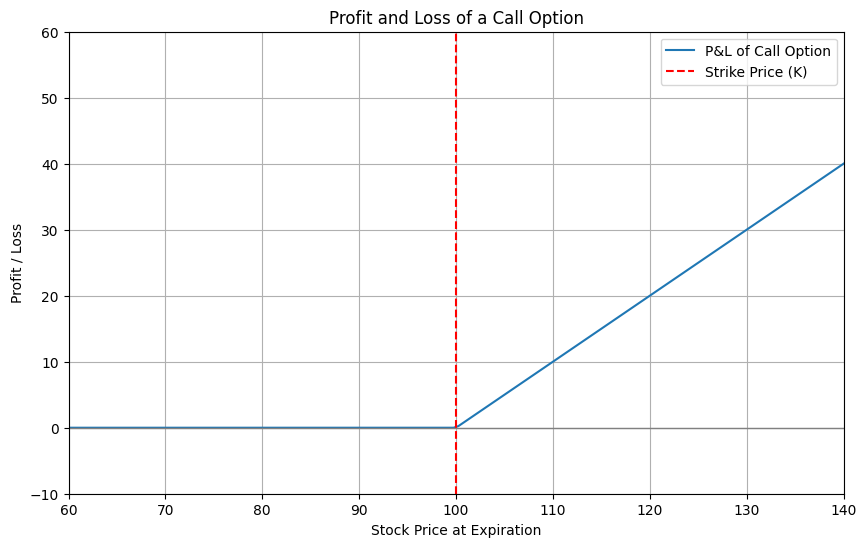

# Convolution and the volatility curve

In this post I'll try to explain what the volatility curve is and what is its relationship with the convolution. 

Volatility is the main factor when evaluating the price of an option. If there was no volatility, then the price of an option would just be the expected P&L at expiry. 

However, since the volatility value is almost never zero, and we still have some time to maturity, then we can expect the underlying to move around. Usually, the way we model the returns is as $N(0, t\sigma^2)$. Therefore, the value of the option is not the value at expiry, but it is an average of the values that it can reach at expiry weighted by their respective probability. 
This operation is called convolution and is defined as:

$$(f*g)(x):=\int_{-\infty}^{\infty}f(t)g(x-t)dt   $$

where f is the shifted ReLu=$max(0,S-X)$ and g is the normal distribution of mean 0 and variance $t\sigma^2$. A friend sent my this [video](https://www.youtube.com/watch?v=KuXjwB4LzSA) which gives a cool explanation.

The value of an option is therefore the convolution of the distribution of returns and the P&L graph at expiry. 
