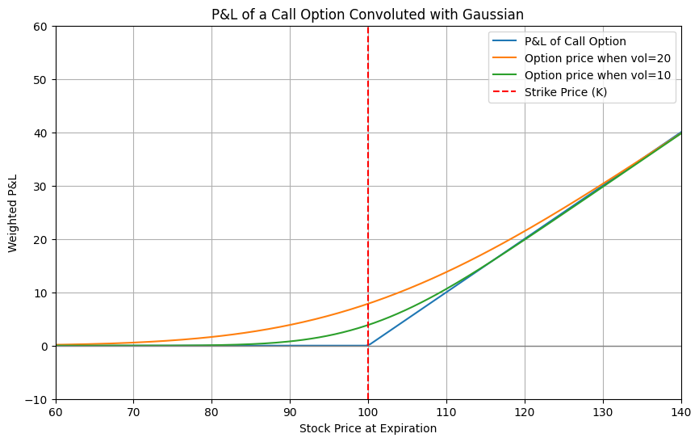
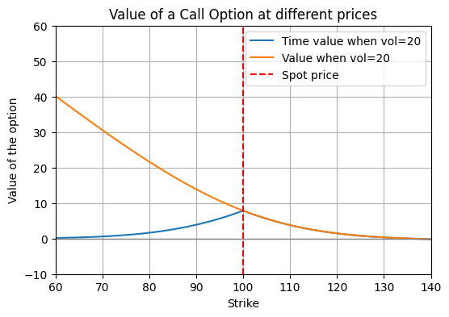
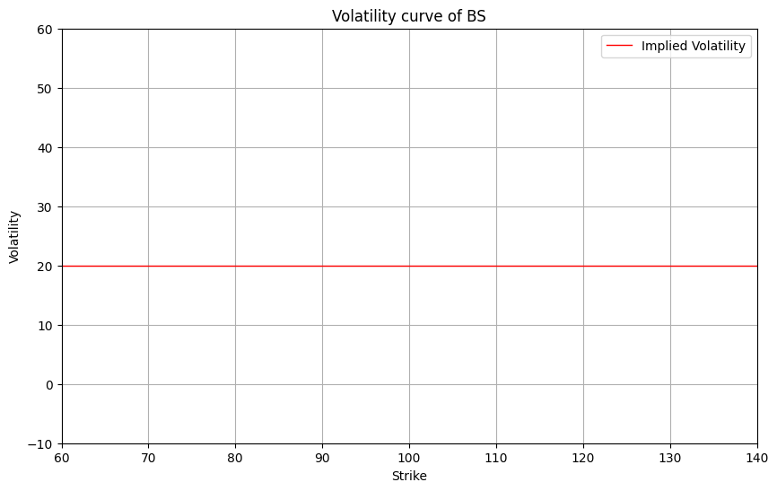
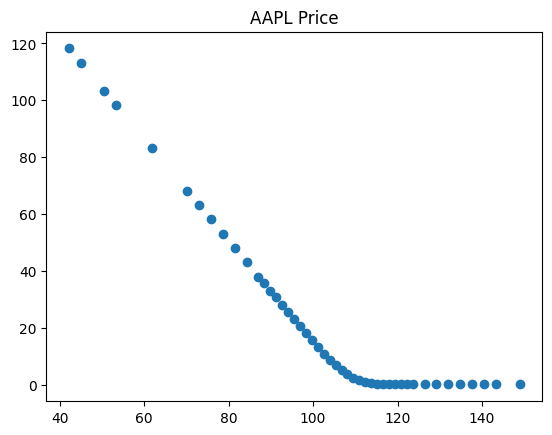
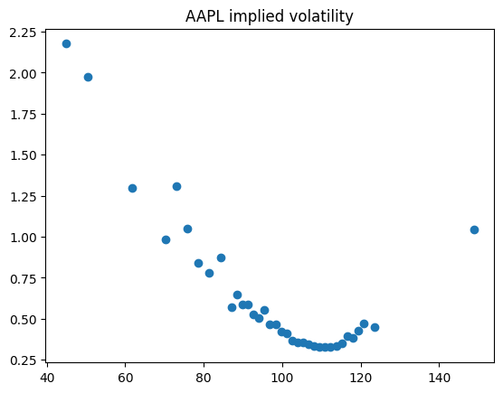

# Convolution and the volatility curve

In this post I'll try to explain what the volatility curve is and what is its relationship with the convolution. 

Volatility is the main factor when evaluating the price of an option. If there was no volatility, then the price of an option would just be the expected P&L at expiry. 
prova comv 

However, since the volatility value is almost never zero, and we still have some time to maturity, then we can expect the underlying to move around. Usually, the way we model the returns is as $N(0, t\sigma^2)$. Therefore, the value of the option is not the value at expiry, but it is an average of the values that it can reach at expiry weighted by their respective probability. 
This weighted average operation is called convolution and is defined as:

$$(f*g)(x):=\int_{-\infty}^{\infty}f(t)g(x-t)dt   $$

where f is the shifted ReLu=max(0,S-X) and g is the normal distribution of mean 0 and variance $t\sigma^2$. A friend sent my this [video](https://www.youtube.com/watch?v=KuXjwB4LzSA) which gives a cool explanation.

The value of an option is therefore the convolution of the distribution of returns and the P&L graph at expiry. 

The convolution is particularly tied with the normal distribution because:
* the convolution of two normal distribution is a normal distribution
* if you do the convolution of a distribution with itself many times the limit tends to a normal distribution (central limit theorem)

In this sense Gaussians (more precisly Levy distributions) are attractors for the convolution operation. This is very important because it somewhat justifies the choice of the normal as the modeling distribution of the returns. The only catch is that the CLT works only for the central part of the distribution. If the tails are very fat (power law-like), then the tail of the limiting distribution will also be fat. The central area that we can trust to be normal is $\approx N^{3/4}\sigma$ (with N being the number of times a distribution was convoluted with itself).

The spread between the red and green line and the blue is called time value. In the money options have also (Spot-Exercise) intrinsic value. This price is the Black-Scholes price, and the value of an option with strike K is therefore:

Moreover, if we do the the inverse operation and ask ourselves, what is the volatility value of the normal that was convoluted with the pnl curve, we would get an horizontal line throughout all the strikes. This is the volatility curve of BS prices.

However, if we take the price of a call option on the market

And do the inverse operation

We don't get a straight line, this is called volatility smile. The market "overestimates" big movements (kurtosis), and in particular big downside movements (skew).
